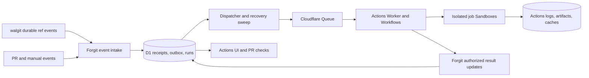

# Forgit Actions: design and implementation plan

Status: initial implementation is on `feat/forgit-actions` (2026-09-24). See [the implemented contract, rollout instructions, and verification](ACTIONS.md). The sections below preserve the original design and later milestones; they are not a claim that every proposed capability has shipped. Cloud provisioning and deployment have not been performed.

## Destination

A repository owner enables Actions, commits a familiar workflow, and sees jobs run for pushes and pull requests. Runs have useful logs, cancellation, reruns, and artifacts. Required checks block merges. A trusted revision can deploy to an environment using explicitly granted secrets and approval rules. Agents can inspect structured results, rerun appropriate work, and propose fixes through the same authorization rules as people.

Keep the existing self-hostable, single-tenant installation model. Actions runs on Cloudflare beside forgit, with its own execution resources. Git objects remain in walgit/R2; D1 holds metadata.

Optimize for time from push to an actionable result. Faster execution is a target to measure, not an assumed benefit of Cloudflare. Agent support begins with reliable APIs and structured evidence; optional repair automation builds on them.

## What the source establishes

Inspected forgit at `b1f5b6fe7af5c43f95cb736bd4d4f1d9eb7d52d0`, its pinned walgit at `80e9a20b29e29aefd16a4dae6f8e274cce85cca5`, and Cloudflare CI at `fbbc2902c07c8ac89612f915f28c58c9b0941dbd` (package version 0.2.0). These are source findings, not live integration results.

| Existing piece                                                                                       | Implication for Actions                                                                                                                                 |
| ---------------------------------------------------------------------------------------------------- | ------------------------------------------------------------------------------------------------------------------------------------------------------- |
| walgit already tails its WAL and emits signed ref-event batches with durable cursors                 | Configure and consume this bridge; do not infer accepted refs from HTTP status. The contract is at least once and includes retention-gap handling.      |
| forgit already enables walgit's `events` role, but has no event sink configured                      | The first event integration should mostly be configuration and a durable consumer.                                                                      |
| Check runs, required-check rules, and PR check UI exist                                              | Extend these with execution provenance and run links. Keep current-head merge enforcement.                                                              |
| `recordCheck()` calls `requireRepo(..., "write")` before checking `checks:write`                     | A token with just `repo:read` and `checks:write` cannot currently report checks. Separate permission to report results from permission to push Git.     |
| Checks are upserted by repository, name, and SHA                                                     | Existing rows are a current-result projection, not run or attempt history. Old callbacks could overwrite newer results without additional fencing.      |
| PATs support repository restrictions, expiry, and machine kind; `workflow:run` exists                | Reuse these foundations, but define Actions permissions and run-specific authorization explicitly.                                                      |
| Cloudflare CI supplies Workflow orchestration, Sandbox runners, snapshots, and provider callbacks    | It is the preferred engine to evaluate; forgit still owns workflow discovery, authorization, run records, scheduling policy, UI, and deployment policy. |
| Cloudflare CI's public exports and binding types still assume Cloudflare Artifacts in several places | Verify a real custom provider against the published package. A small maintained patch or upstream change may be necessary.                              |
| Each `ci.runner()` starts a fresh Sandbox and successful runners snapshot `/workspace`               | Do not assume Actions-style steps share a process or installed system tools. Evaluate one runner per job with ordered shell steps.                      |
| Git checkout copies source into `/workspace` without `.git`                                          | Decide checkout semantics explicitly; verify tools that call Git, exact-SHA fetching, LFS, and submodules before claiming support.                      |
| Failure output is a bounded tail; successful large logs can be streams; raw logs are not masked      | Full logs, live delivery, masking, and persistence need an explicit implementation and runtime proof.                                                   |
| Snapshot restore overlays new source and can retain deleted files                                    | Disable cross-run workspace caching initially. Add dependency caches only with clean source and trust isolation.                                        |
| Default runner retries can execute a command again                                                   | Test failures should not automatically rerun. Deployment commands require explicit retry and reconciliation policy.                                     |

Evidence: [walgit event contract](https://github.com/tobi/walgit/blob/80e9a20b29e29aefd16a4dae6f8e274cce85cca5/docs/EVENTS.md), [CI provider adapter](https://github.com/cloudflare/ci/blob/fbbc2902c07c8ac89612f915f28c58c9b0941dbd/src/source-control-adapter.ts), [CI bindings](https://github.com/cloudflare/ci/blob/fbbc2902c07c8ac89612f915f28c58c9b0941dbd/src/env.ts), [CI runner](https://github.com/cloudflare/ci/blob/fbbc2902c07c8ac89612f915f28c58c9b0941dbd/src/ci/runners/sandbox.ts), [CI checkout](https://github.com/cloudflare/ci/blob/fbbc2902c07c8ac89612f915f28c58c9b0941dbd/src/shared/source-checkout.ts).

Local entry points: [Worker and Git proxy](../apps/web/worker/index.ts), [domain services](../packages/domain/src/services.ts), [check projection](../packages/db/src/sql-store.ts), [merge policy](../packages/domain/src/merge-policy.ts), [token scopes](../packages/auth/src/scopes.ts), [Git configuration](../services/git/walgit.toml).

## Proposed architecture



- `apps/web`: existing browser UI and PAT APIs, signed event intake, policy decisions, metadata, and result projection.
- `apps/actions`: new Worker with Queue consumption, the trusted Workflow interpreter, the forgit source provider, and Sandbox lifecycle. Access forgit through a narrow service interface rather than giving job processes database access.
- `packages/actions`: pure workflow schema, validation, event matching, execution-plan construction, and state transitions. Put runtime code in the Worker; avoid building an engine abstraction beyond what this integration needs.
- A separate Actions R2 bucket stores execution output and disposable caches. Never give jobs access to the Git bucket or its credentials.
- Workflow definitions are repository data. A shared deployed interpreter executes validated plans. Do not import arbitrary repository TypeScript into the privileged Worker.

Use Cloudflare CI where its semantics fit. Milestone 0 decides whether it is usable directly or needs a bounded patch. If that patch becomes a replacement runner, record that finding and reconsider direct Workflows + Sandbox before building the rest of the product around it.

## Workflow contract to settle

Recommended first format: `.forgit/workflows/*.yml`, versioned schema, shell commands, named jobs, ordered steps, job dependencies, timeouts, branch/tag filters, explicit environment references, and manual dispatch. Use familiar keys such as `on`, `jobs`, `runs-on`, `needs`, `steps`, `run`, `env`, and `timeout-minutes`. Support a documented bounded set of context/secret references instead of arbitrary expression evaluation. Define unsupported features precisely, and show migration diagnostics for existing GitHub workflow files.

Illustrative CI workflow; this is a proposed format, not an implemented API:

```yaml
version: 1
name: CI
on:
  push: {}
  pull_request: {}
  workflow_dispatch: {}
jobs:
  test:
    runs-on: node-26
    timeout-minutes: 15
    steps:
      - name: Install
        run: pnpm install --frozen-lockfile
      - name: Check
        run: pnpm check
```

Checkout is performed by the platform before steps. Runner names select administrator-managed images with pinned toolchains. One job owns one workspace; steps run in order in fresh shells, with files retained. Jobs share files only through explicit artifacts, not through `needs`.

Reject unknown features and malformed configuration visibly. Validate dependency cycles, job/step counts, file size, timeouts, runner names, and secret references before starting compute. Use a bounded declarative model; postpone a general expression language.

Record the workflow path, workflow revision, source commit, trigger, ref, validated plan digest, and runner image digest on every run. Reruns use that same definition and source, with current permission and secret-access checks. An edited workflow applies to a new run.

Initial push workflows read configuration from the pushed commit. PR workflows use the PR head as source and configuration for secret-free CI; trusted policy remains in forgit settings and cannot be weakened by editing YAML. Manual runs resolve the chosen ref once. Deployment eligibility is independently checked against environment policy and the pinned revision.

PR checks initially validate the head commit. Synthetic merge testing is a later feature and must be labeled as such when added. A workflow configured for both push and PR may produce separate runs; their identities and required-check selection must remain unambiguous.

## Agent experience and performance

Make every run inspectable through native APIs and MCP from the first useful pipeline. A run response should contain source and workflow revisions, attempt identity, job/step results, exit codes, failing commands, test/annotation references, artifact references, relevant log ranges, and currently permitted next actions. Polling or event subscriptions must support waiting for completion without repeated full-log downloads. Preserve raw evidence alongside derived summaries.

Start with deterministic failure information. Distinguish invalid workflow, checkout failure, failing tests, infrastructure failure, cancellation, and deployment failure. An agent should be able to request a failing step's logs and test results directly. AI explanations can be added as attributed interpretations, with source links; they cannot replace the actual check result.

Implement rerun-failed with defined dependency behavior: reuse only verified successful outputs from the same source/plan and compatible runner, or rebuild required dependencies. Every new execution is a recorded attempt, authorized when requested. Do not equate Cloudflare Workflow replay with a user-requested rerun.

Once CI is reliable, add opt-in diagnosis and repair jobs. They receive selected failure evidence, a bounded time/token budget, an administrator-configured model connection, and explicit capabilities. Default to diagnosis; a repair job may push a new branch and open a PR only when that repository enables those capabilities. Its commits go through normal CI and review. Record which agent/model initiated the action and which run it was responding to. Prevent recursive repair loops, and never supply the merge service principal. Job repository content and logs are untrusted input to the agent; tool authorization remains outside the model.

Suggested order for making it faster:

1. Measure an identical workload's push-to-start, checkout, dependency install, execution, first useful log, and completion times; record cold/warm runs, image/toolchain, resource class, and cost. Compare with a GitHub Actions baseline where an equivalent fixture is available.
2. Use one Sandbox per job so ordinary steps share a workspace and avoid snapshot/restore between every command. Benchmark any Cloudflare CI patch needed for that model.
3. Add clean checkout plus dependency caches scoped by content and trust, immutable artifacts between jobs, and bounded DAG parallelism.
4. Cancel superseded PR runs, stream logs early, and rerun only the work whose inputs or failed dependencies require execution.
5. Consider warm capacity only if the measured queue/cold-start benefit justifies idle resource cost. Do not reuse a dirty job Sandbox across trust boundaries.

Track p50/p95 feedback latency, first-log latency, failure diagnosis time, and resource cost per run. Set numeric release targets after milestone 0 produces comparable measurements. Avoid caching test success on dependency-lockfile changes alone; a result cache would need the full execution inputs and a separate correctness contract.

## State and authorization rules

Suggested metadata entities:

- `action_events`: authenticated event identity, repository, ref, old/new SHA, producer, receipt time, and dispatch state. Preserve WAL sequence as a string or lossless integer.
- `action_dispatches`: durable outbox records with claim/lease and retry state, so D1 writes and Queue delivery do not need a distributed transaction.
- `action_runs` and `action_run_attempts`: workflow identity, immutable input/plan, trigger, run number, initiator, state, conclusion, and Workflow instance ID.
- `action_jobs` and `action_steps`: execution status, timestamps, Sandbox identity, cancellation state, and bounded output references.
- `action_artifacts`: object keys, size, digest, retention, producer attempt, and access policy. Full output bytes stay in R2.
- Later: encrypted secret versions, environments, deployment attempts, and approval records.

Keep status separate from conclusion. Model queued, running, waiting for approval, cancelling, and completed states; record success, failure, cancelled, skipped, timed out, and infrastructure error as appropriate. State updates use attempt identity and compare-and-swap rules. Terminal attempts cannot become successful because a delayed callback arrives.

Deduplicate walgit events using its normative `(repository, WAL sequence, ref)` key, namespaced to the installed storage source/repository incarnation. Deduplicate run creation by event plus workflow identity. A commit SHA alone is insufficient: the same commit may run on multiple refs, triggers, workflows, and rerun attempts. Assign each attempt its own Workflow instance ID; do not use Cloudflare CI's SHA-only helper unchanged.

Required checks must bind to a trusted producer and workflow/job identity, not just a display name. A user posting an identically named check cannot satisfy an Actions requirement. New attempts supersede old attempts under an explicit policy; delayed results cannot restore an obsolete success. Invalid or missing required workflows never become a passing check. The existing merge helper remains the only holder of `svc:forgit-merge` authority.

Authorization proposal:

| Caller               | Allowed operations                                                                                                                                   |
| -------------------- | ---------------------------------------------------------------------------------------------------------------------------------------------------- |
| Repository reader    | View run metadata allowed by repository visibility; initial logs/artifacts require authenticated repository access.                                  |
| Repository writer    | Start, rerun, and cancel permitted workflows; PATs additionally need the corresponding Actions scope.                                                |
| Repository admin     | Enable Actions, set limits, manage secrets/environments, and configure required checks.                                                              |
| Environment approver | Approve a particular deployment revision and attempt according to administrator policy.                                                              |
| Sandbox job          | Short-lived repository read credential for checkout, plus only the secrets explicitly authorized for that job. No check-writing or merge credential. |
| Trusted orchestrator | Report status for its assigned run/attempt through an authenticated service interface; request authorized credentials and revoke them on completion. |

Extend the existing PAT model for machine credentials; do not let a repository select its own principal or request unrestricted Worker secrets. Changes to membership, archive state, Actions enablement, and environment rules are rechecked when work starts and when deployment credentials are released.

## Milestones and acceptance criteria

### 0. Prove the engine contract

Create a disposable integration fixture with the actual published Cloudflare CI package and the same Workers runtime used for deployment. No production credentials are needed. Resolve provider typing/exports and document any exact patch, with ownership and an upgrade strategy.

Prove:

- A private forgit commit can be fetched by immutable SHA using a read-only machine token, even when the branch has advanced. If unreachable commits are not retained long enough, define an explicit pinning/retention mechanism before reruns are promised.
- A custom provider works without migrating Git storage to Artifacts.
- Ordered shell steps preserve job workspace state; job boundaries isolate workspaces.
- Passing and failing jobs preserve complete output beyond the current preview limit; large output is persisted before returning durable step metadata. Do not return live streams as persisted run state.
- Cancellation terminates the active process and destroys the Sandbox; timeouts and Worker replay leave no abandoned compute.
- Runner errors, test failures, and result-reporting failures are distinguishable. Test commands use no automatic retries; ambiguous deployment outcomes are never blindly repeated.
- Cold start, checkout, execution, cleanup, and snapshot overhead are measured separately on a representative `pnpm check` workload, with a repeatable baseline and resource/cost context.

Exit: a short compatibility decision with runtime evidence and a bounded list of upstream changes. This is the first implementation task; no large scheduler or UI should precede it.

### 1. Durable events and trusted run records

Configure walgit's signed event bridge. Intake verifies the raw-body signature, validates batches, and persists idempotent receipts before acknowledgment. A D1 outbox dispatcher sends work through Queue; a scheduled sweep repairs interrupted dispatch. Queue retries reuse run identity, and a dead-letter path surfaces persistent failures.

Start with one opt-in repository and a short event sweep interval. Before wider release, validate R2 manifest notifications through Queue to the authenticated walgit notify endpoint, with sweep as backstop. Keep one active event producer. Test container sleep/wake behavior, first-enable history replay, event batch limits, and WAL-retention gaps; monitor and provide an explicit backfill procedure.

Create run/attempt/job metadata and a minimal run page immediately. Fix check-reporting authorization and producer provenance as part of this milestone, before results can satisfy merge policy.

Exit: accepted CLI pushes, helper file writes, and squash merges produce the expected ref events; rejected/no-op pushes and LFS uploads do not. Redelivery, process restart, and interrupted Queue sends lose no acknowledged work and create no duplicate attempts. Branch deletion creates no checkout job. Git remains usable during a CI outage.

### 2. First useful Actions pipeline

Connect one administrator-configured pipeline to the accepted events. For forgit itself, use a pinned Node 26/pnpm 12 runner and `pnpm install --frozen-lockfile` followed by `pnpm check`. Persist results and logs and link runs from the PR checks UI. Add manual rerun and cancellation with distinct attempts. Expose list/view/logs/rerun/cancel operations through native APIs and MCP, with structured failure records and explicit scopes. Start without cross-run caches or deployment secrets.

Exit: a failing commit blocks merge; a passing current-head commit permits the check requirement; a late older attempt cannot satisfy it. Checkout credentials cannot push, job code cannot publish trusted success, and a user's similarly named check cannot impersonate Actions. Logs remain accessible after the Sandbox is destroyed. An external coding agent can identify the failing command and retrieve its evidence without browser scraping. A live private Git transport run proves the full path.

This is the first operational milestone, not the complete Actions release.

### 3. Repository workflows and scheduling

Implement the agreed schema and immutable plan builder. Discover workflows at the selected revision; support push, PR open/update, tag, and manual triggers. PR mutations need durable internal events: the existing synchronous outgoing webhook mechanism is not a reliable scheduler. Derive PR head updates from accepted ref events and use server-resolved commit IDs.

Execute a bounded job DAG with ordered steps, dependency failure propagation, stable job identities, and deterministic Workflow step names. Limit concurrent jobs per installation/repository. Support replacing obsolete PR runs; deployments serialize per environment and do not inherit PR cancellation behavior.

Exit: adding or editing a workflow needs no Worker redeploy. Invalid files produce actionable diagnostics. Concurrent refs at the same SHA remain distinct. Old attempts cannot race new ones. Workflow replay schedules no duplicate jobs and resolves dependencies consistently.

### 4. Complete the CI experience

Add an Actions tab, run list, job/step detail, live logs, cancellation progress, rerun controls, commit/PR links, and artifact download. Private-repository authorization covers every metadata, log, and artifact route. Add bounded log ingestion and masking before persistence, artifact size limits, cleanup/retention, and cache controls.

Add dependency caching only after fresh checkout is proven to remove deleted tracked files. Scope caches by repository, trust level, runner image/toolchain, and cache inputs. Untrusted jobs must not publish caches later consumed by privileged deployment jobs. Artifacts carry producing run/attempt and digest; cache snapshots do not substitute for release artifacts.

Extend the native APIs/MCP with test results, annotations, artifacts, event waiting, and rerun-failed. Define the supported `gh run`/`gh workflow` subset separately, with compatibility tests before claiming support. Add opt-in agent diagnosis, then bounded repair-to-PR once result provenance and permissions are established. Evaluate it with a known failing fixture: the agent links evidence, proposes a fix, triggers normal CI, and cannot approve or merge its own repair through a privileged path.

Exit: an operator can diagnose a failing run, cancel it, rerun the same revision, and retrieve its output entirely from forgit. Restart and retention tests leave honest final state, readable retained logs, and no abandoned Sandboxes.

### 5. Controlled delivery

Add repository/environment secrets encrypted with a versioned application key, environment policy, deployment approvals, and deployment records with target, revision, artifact, URL, and outcome. A repository workflow names a secret; server policy decides whether to release it. Secrets are never stored in workflow payloads or logs as plaintext.

Start with a real staging deployment using explicit environment credentials. PR jobs receive no deployment secrets. A production job requires a trusted eligible revision and, where configured, approval tied to that run/attempt and artifact. Recheck eligibility after approval. Deploy from a fresh controlled workspace; do not restore an untrusted CI workspace into a credentialed job.

Serialize deployments to each environment. Use provider idempotency where available and record a deployment intent before calling the provider. An uncertain result is reconciled with the target before retry. Rollback is an explicit deployment of a previously recorded artifact/revision, with the same authorization policy.

Exit: unauthorized workflows cannot obtain environment credentials; a changed revision invalidates approval; retries cannot silently repeat an ambiguous deployment. A staging deployment is independently verified at its target, with the deployed revision visible in forgit. Production enablement follows that proof.

### 6. Self-hostable release and operations

Document installation of Workflows, Queue, Sandbox/DO bindings, Actions R2, secrets, and D1 migrations; document upgrades, restore, shutdown, and cleanup. Update the original release decisions and self-hosting guide when the runner actually ships.

Expose queue age, dispatch errors, event lag/gaps, running jobs, orphan cleanup, deployment waits, storage consumption, and execution usage. Apply configurable limits and an installation-wide pause switch. Restore starts Actions paused so recovering metadata cannot silently replay deployments.

Exit: install into a clean test account, run private-repository CI, execute a staging deployment, recover after an interrupted run, and remove the installation without leaving active containers or inaccessible retained data. Run `pnpm check` and the relevant live Git/gh scripts at their delivery gates; record exactly which live paths were verified.

## Ordering and deliberate deferrals

Milestone 0 precedes the engine commitment. Milestones 1–2 establish correctness. Milestones 3–4 deliver usable repository CI. Milestone 5 completes the initial CI/CD scope. Operational limits, cleanup, and access checks start with the first runner; milestone 6 packages and verifies them for self-hosting.

Defer marketplace `uses:` actions, a general GitHub expression interpreter, reusable workflows, matrix expansion, service containers, arbitrary runner images, self-hosted runner registration, Windows/macOS runners, scheduled workflows, synthetic merge queues, and autonomous merging/deployment by repair agents. These are later product decisions, not implicit compatibility promises. Familiar YAML and API/MCP access are initial requirements; bounded agent diagnosis and repair proposals are part of the planned Actions experience.

## Decisions still requiring agreement

1. Workflow compatibility details within the agreed GitHub-like experience: exact YAML subset, bounded expression/reference syntax, runner image names, and which commonly used steps deserve built-in equivalents. Full marketplace compatibility is not assumed.
2. Pilot repositories and first deployment target. forgit's own tests and a staging Worker are useful defaults; confirm before live work.
3. Initial limits: concurrency, job duration, log/artifact size, retention, and resource budget. Choose from the milestone 0 measurements and actual Cloudflare account limits.
4. Engine adoption after the spike: direct package, bounded maintained patch, or direct Workflows/Sandbox if the package cannot meet the contract economically.

Workflows have bounded event/result sizes, so persist bulk output externally and pass references ([Workflows limits](https://developers.cloudflare.com/workflows/reference/limits/)). Estimate cost from measured Sandbox runtime/resources, Workers/DO operations, Workflow usage, Queue operations, and R2 storage/requests. Sandbox pricing follows Containers plus related platform usage ([Sandbox pricing](https://developers.cloudflare.com/sandbox/platform/pricing/)); obtain current account rates and limits before setting a budget.
